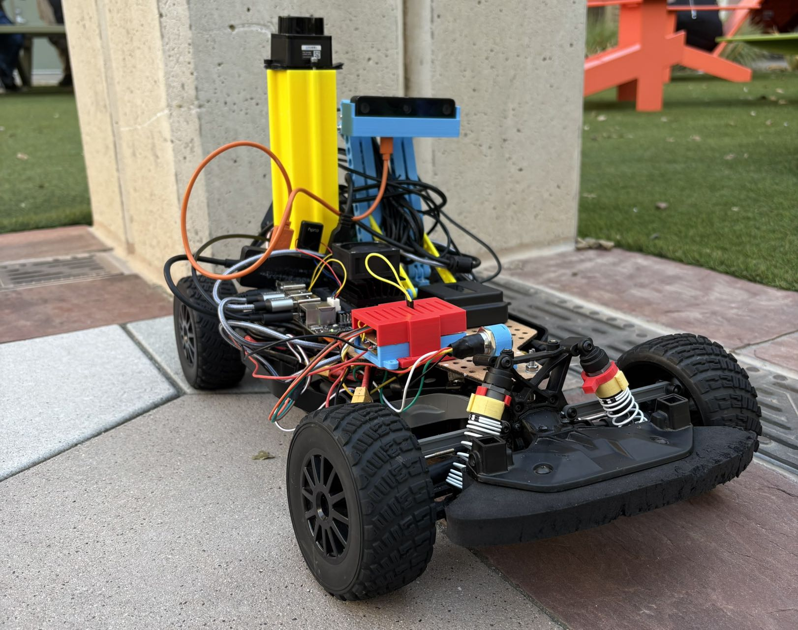
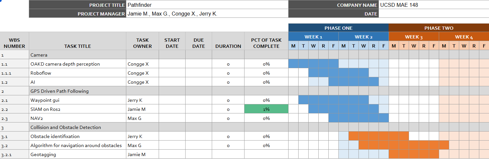
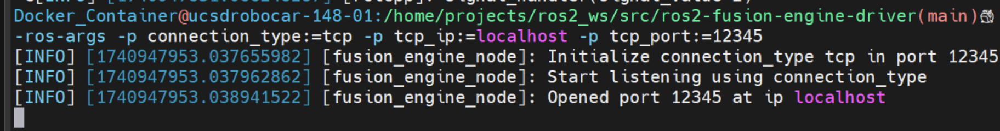
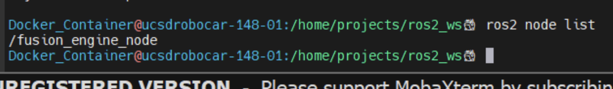
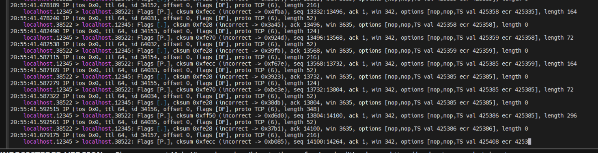
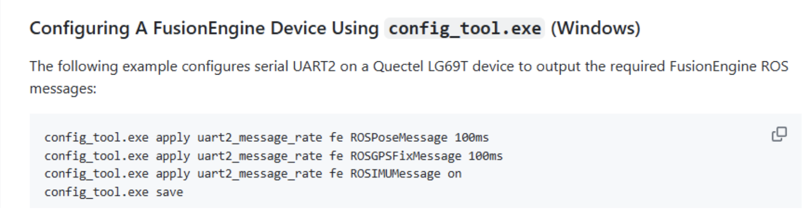
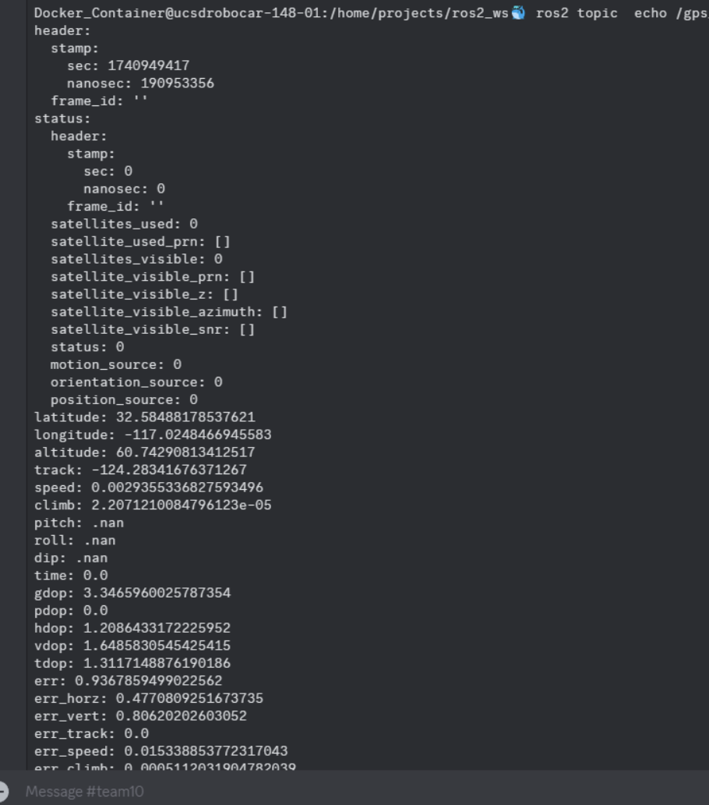

# <div align="center">Path Finder</div>

### <div align="center"> MAE 148 Final Project </div>
#### <div align="center"> Team 10 Winter 2025 </div>



## Table of Contents
  <ol>
    <li><a href="#team-members">Team Members</a></li>
    <li><a href="#abstract">Abstract</a></li>
    <li><a href="#accomplishments">Accomplishments</a></li>
    <li><a href="#challenges">Challenges</a></li>
    <li><a href="#final-project-videos">Final Project Videos</a></li>
    <li><a href="#software">Software</a></li>
    <ul>
            <li><a href="#homegrown-waypoint-follower">Homegrown WayPoint Follower</a></li>
    </ul>
    <li><a href="#hardware">Hardware</a></li>
    <li><a href="#gantt-chart">Gantt Chart</a></li>
    <li><a href="#course-deliverables">Course Deliverables</a></li>
    <li><a href="#additional-documentation">Additional Documentation</a></li>
        <ul>
            <li><a href="#lidar-setup">Lidar Setup</a></li>
            <li><a href="#point-one-nav-gps-on-ros2-instructions">Point one nav GPS on ROS2 Instructions</a></li>
            <li><a href="#artemis-imu-bring-up">Artemis IMU Bring Up</a></li>
            <li><a href="#vesc-with-odometry-publishing">VESC with Odometry Publishing</a></li>
        </ul>
    <li><a href="#acknowledgements">Acknowledgements</a></li>
    <li><a href="#contacts">Contacts</a></li>
  </ol>

<hr>

## Team Members
- Max Guerrero - Embedded Software UCSD Ext (B.Sc. Comp. Physics 2021)
- Jerry Ko (B.S Electrical Engineering)
- Congge Xu (B.S. Computer Engineering)
- Jamie Miller (B.Sc Aerospace Engineering)

<hr>

## Abstract
Pathfinder was envisioned as an autonomous vehicle designed to provide assistance to search and rescue personnel in remote environments.
- Navigate GPS waypoints
- Identify humans in need
- Generate a map for first responders to use in rescue missions.


<hr>

## Accomplishments
* Working drivers that successfully push to topics for:
  - GPS Data
  - Scan lidar data
  - IMU gyro and accel data
  - Odom from VESC node
* Rudimentary Waypoint follower “Homegrown”
  - NAV2 did not work as expected
    - Many hours were spent troubleshooting dependencies and issues with getting it to run with Foxy.
    - Once we did get it to work with Galactic, even when all sensors were up, Nav2 would complain about frames and base links. Needed time to deep div
  - As a result, we pivoted to this. 
    - Validated in Simulation (using mock GPS goals), but ROS2 is being pedantic about QoS.
* The custom model is fine-tuned with the custom dataset and trained on human detection tasks. Multiple model versions utilizing pre-trained model weights (YOLOv11, Roboflow 3.0) have their performances compared and the best one is applied using RoboflowOak API.
  - Best model performance: mAP = 81.6%, Precision = 86.1%, Recall = 72.3%. 
  - RoboflowOak API interacts with the camera and provides human detection results outside of ROS, which the script then processes and uses to publish movement commands within ROS. 
* Use ["MapViz"](https://swri-robotics.github.io/mapviz/) to visualize the real-time location of the robot, and click on the map to publish coordinates for the robot to follow.
  - Could use MapViz to publish and read coordinates but the map is not showing

<hr>

## Challenges
* Faced multiple malfunctioning VESCs:
  - First did not properly steer
  - Second did not properly throttle
  - Third would not turn on
  - Fourth was borrowed from UCSD Blue on the day of the final
* Spent too much time trying to get Docker and ROS2 running on PC's and VMs
* 

<hr>

## Final Project Videos
[](https://youtu.be/18XZ_vilVA8)


<hr>

## Software
### Homegrown WayPoint Follower

### MapViz
  - Ros2 tool to load tile maps and display GPS coordinates input to the corresponding Ros2 topic.
  - However, after trying with the built-in tile map, Google Maps, Stadia maps with working API keys, and [offline Google Map Tile map](https://github.com/danielsnider/MapViz-Tile-Map-Google-Maps-Satellite), we could not make the tile map to show on MapViz.
  - But we did succeed in letting MapViz read mock coordinate data by manually publishing data, and published coordinates by clicking on the MapViz interface.
  
<hr>

## Hardware 

* __3D Printing:__ Camera Stand, Jetson Nano Case, GPS Plate, Lidar Mount
* __Laser Cut:__ Base plate to mount electronics and other components.

__Parts List__

* Traxxas Chassis with steering servo and sensored brushless DC motor
* Jetson Nano
* WiFi adapter
* 64 GB Micro SD Card
* Adapter/reader for Micro SD Card
* Logitech F710 controller
* OAK-D Lite Camera
* LD19 Lidar (LD06 Lidar)
* VESC
* Point One GNSS with antenna
* Anti-spark switch with power switch
* DC-DC Converter
* 4-cell LiPo battery
* Battery voltage checker/alarm
* DC Barrel Connector
* XT60, XT30, MR60 connectors

*Additional Parts used for testing/debugging*

* Car stand
* USB-C to USB-A cable
* Micro USB to USB cable
* 5V, 4A power supply for Jetson Nano

### __Mechanical Designs__
__Camera Mount__
<div align="center">
    
</div>

Credit: [Camera Holder](https://www.thingiverse.com/thing:5336496)

__Circuit Diagram__

Our team made use of a select range of electronic components, primarily focusing on the OAK-D Lite camera, Jetson NANO, a GNSS board / GPS.
Our circuit assembly process was guided by a circuit diagram provided by our class TAs.


<hr>

## Gantt Chart
<div align="center">
    
</div>
<hr>

## Course Deliverables
Here are our autonomous laps as part of our class deliverables:

* [3 Autonomous Laps](https://drive.google.com/file/d/1rYdKuJp95L6o8hU5gIAqILZzjU2uGJZW/view?usp=sharing) 
* [GPS Laps](https://youtu.be/jbZKhUSmnkc?si=7ICiua8Jcp4CKKOG)
* [Oak-D Camera Model](https://cdn.discordapp.com/attachments/1344142206776119386/1346536237007372288/IMG_3482.mov?ex=67e04618&is=67def498&hm=6a8eb74b5d8431f3bcc59a255ffcd0d7b85c87cf8b08f66f8d74673bdc5d60cd&)


Presentations:  
* [Final Presentation](https://docs.google.com/presentation/d/1ZoWhRLhPfD_xljGeW3dEyOw8T_ZkKze7IONw5t4ZVvc/edit?usp=sharing)
<hr>

### Additional Documentation
### __Lidar Setup__
* Method 1:
``` 
  source_ros2
  ros2 launch ucsd_robocar_sensor2_pkg lidar_ld06.launch.py
```
* Method 2:
```
  cd ~
  mkdir -p ldlidar_ros2_ws/src
  cd ldlidar_ros2_ws/src
  git clone https://github.com/ldrobotSensorTeam/ldlidar_stl_ros2.git
  cd ~/ldlidar_ros2_ws
  sudo chmod 777 /dev/ttyUSB0
```

 Enter the launch file corresponding to ld19.launch.py and ensure that the port name is set correctly to USB0.

 ```
  cd ~/ldlidar_ros2_ws
  colcon build
  source install/setup.bash
 ```
 To make the whole thing permanent for new windows you can do:
```
echo source ~/ldlidar_ros2_ws/install/setup.bash >> ~/.bashrc
source ~/.bashrc
```
__To start the node:__
```
cd ~/ldlidar_ros2_ws
ros2 launch ldlidar_stl_ros2 ld19.launch.py
```
__To Visualize:__

Two methods
1. After launching the node, do `<rviz2>`, within the window open up the file in the
readme section of ldlidar_ros2_ws called rviz2 (should be inside a folder called
rviz2)
2. When launching the node, do `<ros2 launch ldlidar_stl_ros2viewer_ld19.launch.py>` instead
Troubleshooting:
*  If on a PC and trying to get the lidar to connect ensure
    - Your micro-usb cable can actually transmit data. In ye olden days you
would be able to tell by looking at the symbol on the cord, where an arrow
on the middle prong of the USB symbol would indicate that it can transmit
data. Unfortunately, there’s a lot of cheap crap these days that has made
this method unreliable. So, ensure that you can transmit data by plugging
in any other device using a micro USB cable. Even then, some cables can
only transmit certain data, so you might be best off just buying a cable to
be absolutely sure it works
    - If you are still having trouble connecting, ensure that you have the latest CP210x drivers for the Serial to COM bridge that is used on the lidar.
Found here:
https://www.silabs.com/developer-tools/usb-to-uart-bridge-vcp-drivers?tab=downloads
    - Ensure that the Lidar is being read by your computer before trying to use it in a VM. This comes with the LDLidar development kit found here:
https://files.waveshare.com/upload/a/a5/Ld_desktop_V2.3.12.zip
* Note, this kit will direct you to a download for the CP210x drivers,
but these are out of date and you should use the ones found on the
manufacturer’s website above


### __Point one nav GPS on ROS2 Instructions__
Follow the install instructions in the GitHub, they work. (Replace humble with Foxy)

GitHub - PointOneNav/ros2-fusion-engine-driver: ROS 2 driver for Point One FusionEngine protocol and
devices.


```
# Need to run with TCP port (Run this in host machine since TCP traffic is bridged from host to container)
# Make sure you are not in any other virtual environment (deactivate if so)
mamba activate py37
cd ~/quectel/p1_runner
python3 bin/runner.py --device-id yZ952ezI --polaris 3gGOrFMX --device-port /dev/ttyUSB0 --tcp
12345
```
* Note: You may need to change the USB* value depending on which USB* your GPS
enumerated on

```
# Inside the container run this ros package and node. You should get an acknowledgment that the TCP
connection to the specified port was correct #
# source_ros2
# cd /home/projects/ros2_ws/src/ros2-fusion-engine-driver
# source install/setup.bash
# ros2 run fusion-engine-driver fusion_engine_ros_driver --ros-args -p connection_type:=tcp -p
tcp_ip:=localhost -p tcp_port:=12345
```
<div align="center">
    
</div>
```
# On the container but within another terminal verify that the node is running
$ ros2 node list
```
<div align="center">
    
</div>

Run within container (different terminal)
Verify you are getting traffic below:
<div align="center">
  
</div>
Needed to do this step to get the ROS rates or else data wouldn't be received properly on
ros end
<div align="center">
  
</div>
Now the data was received properly!
<div align="center">
  
</div>

Serial and rtk:
```
ros2 launch ntrip_client ntrip_client_launch.py username:=yZ952ezI password:=3gGOrFMX
```

### Artemis IMU Bring Up
This sensor pkg is actually already built upon creating a new robocar container we obtained in this class from the
Robocar framework documentation MAE 148
First, make sure you have identified which USB* the Artemis IMU has enumerated.
Once that is done, edit the device location here:

/src/ucsd_robocar_hub2/ucsd_robocar_sensor2_pkg/config/my_razor.yaml

Rebuild for this to take effect
```
source_ros2
Build_ros2
ros2 launch ucsd_robocar_sensor2_pkg imu_artemis.launch.py
```
* NOTE: Having an SD card inserted causes an error when reading the data from the serial port, so make
sure it is not inserted


### VESC with Odometry Publishing
```
gedit src/ucsd_robocar_hub2/ucsd_robocar_nav2_pkg/config/car_config.yaml
```
Then set oakd to zero and vesc with odom to 1
```
gedit src/ucsd_robocar_hub2/ucsd_robocar_nav2_pkg/config/node_config.yaml
```
Then set all components to 1, set f1nth node to 1, and manual joy to 1 (if you want joystick teleop to test vehicle is working properly)
```
source_ros2
Build_ros2
ros2 launch ucsd_robocar_nav2_pkg all_nodes.launch.py
```

## Acknowledgements
Thanks to Professor Jack Silberman and TAs including Alexander and Winston for providing great advices to help complete this project.

**Programs Reference:**
* [UCSD Robocar Framework](https://gitlab.com/ucsd_robocar2)


README.md Format, reference to [winter-2024-final-project-team-7](https://github.com/UCSD-ECEMAE-148/winter-2024-final-project-team-7)

<hr>

## Contacts
* Max Guerrero: MaxGuerrero94@gmail.com
* Jamie Miller: jlm005@ucsd.edu
* Congge Xu: cox002@ucsd.edu
* Jerry Ko: pko@ucsd.edu

